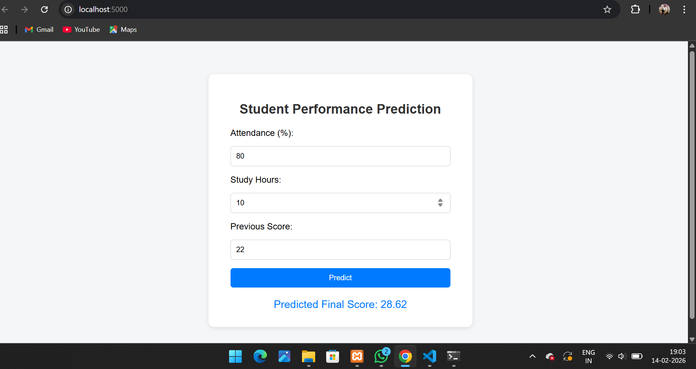

# 🎓 Student Performance Analysis & Prediction System

A full-stack project for analyzing and predicting student academic performance using MySQL, Python, Machine Learning, and a Flask web app.

---

## 📋 Table of Contents
- [Project Overview](#project-overview)
- [Features](#features)
- [Database Schema & SQL](#database-schema--sql)
- [Data Analysis & Visualization](#data-analysis--visualization)
- [Machine Learning Model](#machine-learning-model)
- [Web Application (Flask)](#web-application-flask)
- [Setup Instructions](#setup-instructions)
- [Screenshots & Demo](#screenshots--demo)
- [Technologies Used](#technologies-used)
- [License](#license)

---

## Project Overview
This project provides a complete workflow for student performance analysis and prediction:
- MySQL database with 30+ sample student records
- SQL queries for insights and reporting
- Python data analysis (Pandas, Matplotlib, Seaborn)
- Machine learning regression model (scikit-learn)
- Flask web app for real-time score prediction

---

## Features
- **Database:** MySQL with a normalized students table and 30+ records
- **SQL Analysis:** Top students, gender-based stats, attendance filter, study hours impact, correlation
- **Python Analysis:** Data cleaning, statistics, correlation, and visualizations
- **Machine Learning:** Regression model to predict final scores
- **Web App:** User-friendly Flask app for predictions
- **Documentation:** Complete setup and usage guide

---

## Database Schema & SQL
- **Database:** `student_analysis`
- **Table:** `students`
  - `id` (INT, PRIMARY KEY, AUTO_INCREMENT)
  - `name` (VARCHAR)
  - `gender` (ENUM)
  - `attendance` (FLOAT)
  - `study_hours` (FLOAT)
  - `previous_score` (FLOAT)
  - `final_score` (FLOAT)
- **SQL script:** See `student_analysis.sql` for schema, sample data, and queries:
  - Top 5 students by final_score
  - Average final_score by gender
  - Students with attendance < 75%
  - Study hours vs final_score relationship

---

## Data Analysis & Visualization
- **Connect Python to MySQL** and load data into Pandas
- **Handle missing values** and perform statistical analysis
- **Correlation matrix** for all numeric features
- **Visualizations:**
  - Attendance vs Final Score (scatter)
  - Study Hours vs Final Score (scatter)
  - Final Score distribution (histogram)
  - Correlation heatmap
- See `student_performance_analysis.ipynb` (or .py) for all code and outputs

---

## Machine Learning Model
- **Regression model** (LinearRegression) to predict `final_score`
- **Train/Test split** for evaluation
- **Metrics:** R2, MAE, MSE
- **Model saved** as `student_score_model.pkl` (pickle)
- **Bonus:** Easily extendable to other regressors (e.g., RandomForest)

---

## Web Application (Flask)
- **Responsive UI** (HTML, CSS, JS)
- **User input:** attendance, study_hours, previous_score
- **Predicts final_score** using the trained ML model
- **Backend:** Flask (Python)
- **Frontend:** Simple, modern, and mobile-friendly
- **Files:**
  - `flask_app/app.py` (Flask backend)
  - `flask_app/templates/index.html` (UI)
  - `flask_app/static/` (CSS, JS)

---

## Setup Instructions

### 1. Clone the repository
```bash
git clone https://github.com/chethanhrx/student-performance-analysis.git
cd student-performance-analysis
```

### 2. Database Setup (XAMPP/MySQL)
- Start XAMPP and MySQL
- Import `student_analysis.sql` using phpMyAdmin or MySQL CLI
  - In phpMyAdmin: Select your database, click Import, and choose `student_analysis.sql`
  - Or in terminal:
    ```bash
    mysql -u root -p < student_analysis.sql
    ```

### 3. Python Environment
- Create a virtual environment (recommended):
  ```bash
  python -m venv .venv
  .venv\Scripts\activate  # On Windows
  # or
  source .venv/bin/activate  # On Mac/Linux
  ```
- Install dependencies:
  ```bash
  pip install -r requirements.txt
  # or manually:
  pip install pandas matplotlib seaborn scikit-learn flask mysql-connector-python
  ```

### 4. Train the Model
- Run the training script to generate `student_score_model.pkl`:
  ```bash
  python train_model.py
  ```
  - This fetches data from your MySQL database and saves the model in `flask_app/`

### 5. Run the Flask Web App
- Go to the Flask app directory:
  ```bash
  cd flask_app
  python app.py
  ```
- Open [http://localhost:5000](http://localhost:5000) in your browser
- Enter attendance, study hours, and previous score to get a prediction

### 6. GitHub Submission
- Add, commit, and push all files to your GitHub repository:
  ```bash
  git add .
  git commit -m "Complete student performance analysis system"
  git push origin main
  ```
- Your GitHub username: **chethanhrx**

---

## Screenshots & Demo

Below is a demo image of the running web application:



> Add more screenshots of the notebook analysis, graphs, and web app UI for best presentation.

---

## Technologies Used
- MySQL (XAMPP)
- Python 3.x
- Pandas, Matplotlib, Seaborn
- scikit-learn
- Flask
- HTML, CSS, JavaScript
- Git & GitHub ([chethanhrx](https://github.com/chethanhrx))

---

## License
This project is open for educational and personal use. Feel free to use, modify, and share.

---

**Author:** chethanhrx

